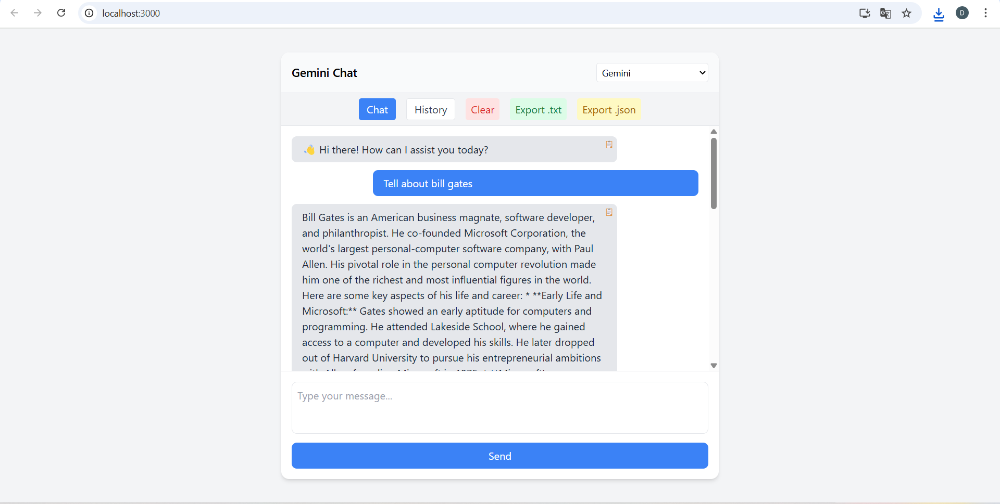

# AI Chat Interface (Gemini API)

A sleek and modern **AI-powered chat interface** built with **React** (frontend) and **Flask** (backend), using **Google Gemini API** for real-time AI responses.



---

## 🚀 Features
- **Real-time AI chat** with streaming responses
- **Model selection dropdown** (Gemini active, others coming soon)
- **Chat history** saved with SQLite
- **Typing animation** for AI messages
- **Responsive UI** for desktop & mobile
- **Secure `.env` API key storage** (never committed to GitHub)

---

## 🛠 Tech Stack
**Frontend:**
- React
- TailwindCSS

**Backend:**
- Flask
- SQLite (for storing chat history)
- Google Gemini API

---

## 📂 Project Structure
chat-ui/
│── assets/
│ └── screenshots/ # Project screenshots for README
│── client/ # React frontend
│── server/ # Flask backend
│── .env # Environment variables (NOT committed)
│── .gitignore # Files & folders to ignore in Git
│── README.md # Project documentation


---

## ⚙️ Setup & Installation

### 1️⃣ Clone the repository
```bash
git clone https://github.com/Nexalytic/chatnova
cd YOUR_REPO_NAME

### 2️⃣ Install dependencies
Frontend:

cd client
npm install

Backend:

cd ../server
pip install -r requirements.txt

### 3️⃣ Set up environment variables
Create a .env file in the server/ directory:

GEMINI_API_KEY=your_gemini_api_key_here

### 4️⃣ Run the application
Start backend:

cd server
python app.py

Start frontend:

cd client
npm start

### 📧 Contact
For questions or collaboration:

Your P.Deepak Raj

Email: deepakraj4198@mail.com

GitHub: [Nexalytic](https://github.com/Nexalytic)
